# Streakly 배지 이미지 가이드

총 **50개** 배지 / 6개 카테고리 / 5단계 희귀도

| 희귀도 | 색상 |
|---|---|
| Common | 회색 |
| Rare | 파란색 |
| Epic | 주황색 |
| Legendary | 금색 |
| Secret | 다크 차콜 |

---

## 🔥 스트릭 (Streak) — 12개

연속 체크인 일수와 관련된 배지입니다.

| 이미지 | 이름 | 희귀도 | 획득 조건 |
|:---:|---|---|---|
| 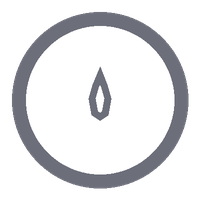 | **첫 불꽃** · First Spark | Common | 첫 스트릭 1일 달성 |
| 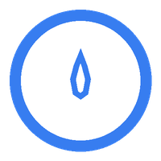 | **불씨** · Ember | Common | 스트릭 3일 연속 |
|  | **작은 불꽃** · Kindling | Common | 스트릭 7일 연속 |
|  | **모닥불** · Campfire | Rare | 스트릭 14일 연속 |
|  | **화톳불** · Bonfire | Rare | 스트릭 21일 연속 |
|  | **용광로** · Furnace | Epic | 스트릭 30일 연속 |
| 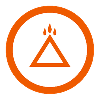 | **불의 지배자** · Fire Lord | Epic | 스트릭 50일 연속 |
|  | **태양** · The Sun | Epic | 스트릭 66일 연속 (습관 완전 정착) |
|  | **영원한 불꽃** · Eternal Flame | Legendary | 스트릭 100일 연속 |
| 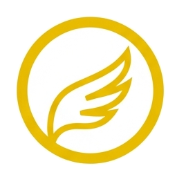 | **불사조** · Phoenix | Rare | 스트릭이 끊긴 후 재시작해 이전 최고 기록 경신 |
|  | **부활** · Comeback | Common | 스트릭 0에서 7일 이상 회복 |
|  | **올해의 불꽃** · Year of Fire | Legendary | 한 해에 누적 스트릭 300일 이상 |

### 아이콘 디자인 의도

스트릭 배지는 **불꽃의 성장**을 시각적 테마로 삼았습니다.
- `streak_001~003`: 점점 커지는 단일 불꽃으로 초반 단계를 표현
- `streak_004~005`: 장작과 불꽃을 함께 그려 모닥불/화톳불 느낌
- `streak_006`: 용광로(아치형 개구부 + 굴뚝) — 지속적 연소
- `streak_007`: 화산 — 폭발적 에너지
- `streak_008`: 태양 + 8개 광선 — 완전한 빛
- `streak_009`: 6각 별 — 영원성과 완성
- `streak_010`: 봉황 날개 — 재생과 부활
- `streak_011`: U자 + 상승 화살표 — 컴백 모션
- `streak_012`: 달력 + 불꽃 — 연간 누적 기록

---

## 🏆 챌린지 완주 (Completion) — 10개

챌린지를 완료한 횟수 및 완료율과 관련된 배지입니다.

| 이미지 | 이름 | 희귀도 | 획득 조건 |
|:---:|---|---|---|
|  | **첫 완주** · First Finish | Common | 챌린지 최초 1회 완료 |
|  | **세 번의 약속** · Triple Vow | Common | 챌린지 3회 완료 |
| 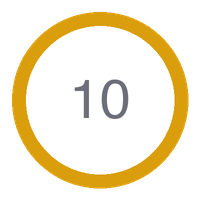 | **10전 10승** · Perfect Ten | Rare | 챌린지 10회 완료 |
|  | **챌린지 마스터** · Challenge Master | Epic | 챌린지 25회 완료 |
| 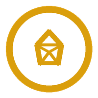 | **완벽주의자** · Perfectionist | Rare | 한 챌린지를 완료율 100%로 완주 |
| 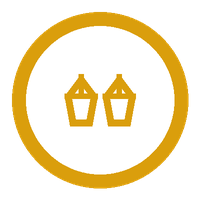 | **두 번의 완벽** · Double Perfect | Epic | 완료율 100% 챌린지 2회 연속 |
|  | **끝까지** · All the Way | Rare | 28일 이상 커스텀 챌린지 완료 |
| 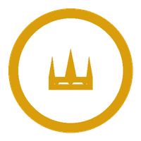 | **삼관왕** · Triple Crown | Rare | 서로 다른 목표명으로 각 1회씩 3회 완료 |
|  | **한 해의 왕** · Champion of the Year | Epic | 한 해에 챌린지 12회 완료 |
|  | **전설의 시작** · Legend Begins | Legendary | 누적 완료율 80% 이상 유지하며 챌린지 20회 완료 |

### 아이콘 디자인 의도

완주 배지는 **목표 달성의 상징물**을 테마로 삼았습니다.
- `complete_001`: 과녁(불스아이) — 목표 적중
- `complete_002`: 세 개의 점 — 세 번의 약속
- `complete_003`: 숫자 "10" — 10회 완주
- `complete_004`: 졸업 모자 — 마스터 수준 도달
- `complete_005~006`: 다이아몬드(1개/2개) — 완벽의 결정체
- `complete_007`: 체커 플래그 — 결승선 통과
- `complete_008`: 왕관(3개 첨탑) — 삼관왕
- `complete_009`: 트로피 + 별 — 연간 챔피언
- `complete_010`: 방패 + 별 — 전설의 시작, 수호와 권위

---

## ✏️ 기록 습관 (Logging) — 8개

데일리 로그 작성 습관과 관련된 배지입니다.

| 이미지 | 이름 | 희귀도 | 획득 조건 |
|:---:|---|---|---|
|  | **첫 기록** · First Entry | Common | 데일리 로그 최초 작성 |
|  | **일주일 일기** · Week Diary | Common | 7일 연속 데일리 로그 작성 |
|  | **21일 일기** · 21-Day Journal | Rare | 챌린지 21일 동안 매일 로그 작성 |
|  | **소설가** · Novelist | Rare | 누적 데일리 로그 100개 작성 |
|  | **말이 많은 날** · Verbose Day | Common | 한 번의 로그에 200자 이상 작성 |
|  | **돌아보기** · Reflector | Secret | 완료된 챌린지의 로그를 30일 후 다시 열람 |
|  | **연대기 작가** · Chronicler | Epic | 누적 데일리 로그 500개 작성 |
|  | **기억의 수호자** · Memory Keeper | Legendary | 1년 이상 기간 동안 로그 기록 지속 |

### 아이콘 디자인 의도

기록 배지는 **글쓰기 도구와 기록 매체**를 테마로 삼았습니다.
- `log_001`: 사선 연필 — 첫 기록의 시작
- `log_002`: 노트북(줄 그어진 표지) — 일기장
- `log_003`: 책갈피 꽂힌 책 — 지속적 저널
- `log_004`: 펼쳐진 오픈북 — 방대한 기록
- `log_005`: 말풍선 + 점 세 개 — 많은 이야기
- `log_006`: 돋보기 — 과거를 다시 들여다봄 (시크릿)
- `log_007`: 두루마리 — 연대기적 기록
- `log_008`: 폴더 — 기억 보관소

---

## ⏱️ 시간 & 루틴 패턴 (Timing) — 8개

체크인 시간대와 요일 패턴과 관련된 배지입니다.

| 이미지 | 이름 | 희귀도 | 획득 조건 |
|:---:|---|---|---|
| 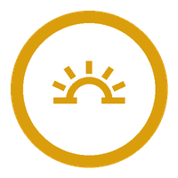 | **새벽 전사** · Dawn Warrior | Common | 오전 6시 이전 체크인 7회 |
|  | **아침형 인간** · Morning Person | Rare | 오전 9시 이전 체크인 21회 연속 |
|  | **야행성** · Night Owl | Common | 자정(00:00) 이후 체크인 5회 |
|  | **칼같은 시간** · Clockwork | Rare | 알림 시간 ±15분 이내 체크인 10회 |
|  | **주말 전사** · Weekend Warrior | Rare | 토+일 연속 체크인 4주 |
|  | **월화수목금** · Weekday Grind | Rare | 월~금 체크인 4주 연속 |
| 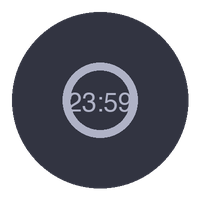 | **자정의 약속** · Midnight Promise | Secret | 23:59 이내 체크인 3회 |
| 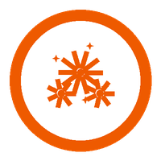 | **신년 첫날** · New Year, New Me | Secret | 1월 1일 체크인 |

### 아이콘 디자인 의도

타이밍 배지는 **하루의 시간대**를 테마로 삼았습니다.
- `timing_001`: 지평선 + 반원 + 5개 광선 — 여명의 일출
- `timing_002`: 완전한 태양 + 12개 광선 — 아침 햇살
- `timing_003`: 초승달(원 + 오프셋 컷아웃) — 야간 활동
- `timing_004`: 스톱워치 (크라운 + 분침/시침) — 정확한 시간
- `timing_005`: 8각 별 — 축제/주말의 에너지
- `timing_006`: 서류 가방 — 평일 근무 루틴
- `timing_007`: 자정을 가리키는 시계 (시크릿) — 막판 체크인
- `timing_008`: 세 개의 불꽃 폭발 — 새해 불꽃놀이 (시크릿)

---

## ➕ 서브루틴 (Subroutine) — 6개

서브루틴 기능 활용과 관련된 배지입니다.

| 이미지 | 이름 | 희귀도 | 획득 조건 |
|:---:|---|---|---|
|  | **첫 서브루틴** · Sub Starter | Common | 서브루틴 포함 챌린지 최초 생성 |
|  | **멀티태스커** · Multitasker | Rare | 서브루틴 3개 이상 포함 챌린지 완료 |
|  | **서브루틴 달인** · Subroutine Master | Epic | 서브루틴 5개 이상 + 완료율 90% 이상 완주 |
|  | **동시에** · Parallel Runner | Rare | 챌린지 2개 동시 진행 중 둘 다 체크인 7일 |
|  | **모두 완료** · Full Sweep | Rare | 메인+서브 전부 당일 완료 21회 |
|  | **궁극의 루틴** · Ultimate Routine | Legendary | 서브루틴 5개 포함 챌린지 100% 완료율로 완주 |

### 아이콘 디자인 의도

서브루틴 배지는 **구조와 병렬성**을 테마로 삼았습니다.
- `sub_001`: 플러스(+) 기호 — 새로운 루틴 추가
- `sub_002`: 세 개의 평행 화살표 — 동시 다중 작업
- `sub_003`: 세 개의 다이얼 노브 — 세밀한 제어와 마스터리
- `sub_004`: 두 개의 번개 — 병렬 실행
- `sub_005`: 굵은 체크마크 — 전체 완료 스윕
- `sub_006`: 지구본(위경도선) — 완전한 시스템, 네트워크

---

## 🤝 팀 챌린지 (Team) — 6개 *(PRO 전용)*

팀 챌린지 참여 및 협력과 관련된 배지입니다.

| 이미지 | 이름 | 희귀도 | 획득 조건 |
|:---:|---|---|---|
|  | **팀 플레이어** · Team Player | Common | 팀 챌린지 최초 참가 |
|  | **팀장** · Squad Leader | Rare | 팀 챌린지 생성 후 완주까지 이끌기 |
|  | **팀 완주** · All for One | Epic | 팀원 전원 챌린지 100% 완료 |
|  | **응원단장** · Biggest Fan | Rare | 하루 팀원 3명 모두 응원 반응 보내기 7일 |
|  | **팀 MVP** · Team MVP | Rare | 팀 챌린지 종료 시 팀 내 1위 |
|  | **전설의 팀** · Legendary Crew | Legendary | 같은 팀원과 3회 이상 팀 챌린지 완주 |

### 아이콘 디자인 의도

팀 배지는 **사람 사이의 연결과 리더십**을 테마로 삼았습니다.
- `team_001`: 두 사람 실루엣 + 연결선 — 첫 팀 합류
- `team_002`: 세 개의 쉐브론 — 군사적 계급/리더십
- `team_003`: 트로피 + 세 개의 별 — 팀 전원 완주
- `team_004`: 메가폰 + 음파 — 응원의 소리
- `team_005`: 5각 별 — MVP 단독 수상
- `team_006`: 크고 작은 별 세 개 — 전설적 팀 조합

---

## 파일 구조

```
assets/images/badges/
├── streak_001.png  ~  streak_012.png   # 스트릭 12개
├── complete_001.png ~ complete_010.png  # 완주 10개
├── log_001.png     ~  log_008.png      # 기록 8개
├── timing_001.png  ~  timing_008.png   # 타이밍 8개
├── sub_001.png     ~  sub_006.png      # 서브루틴 6개
└── team_001.png    ~  team_006.png     # 팀 6개
```

- 해상도: **200 × 200 px** (RGBA, 투명 배경)
- 생성 스크립트: `scripts/generate_badges.py`
- 교체 방법: 동일한 파일명으로 PNG를 덮어쓰면 코드 변경 없이 즉시 반영됩니다.
